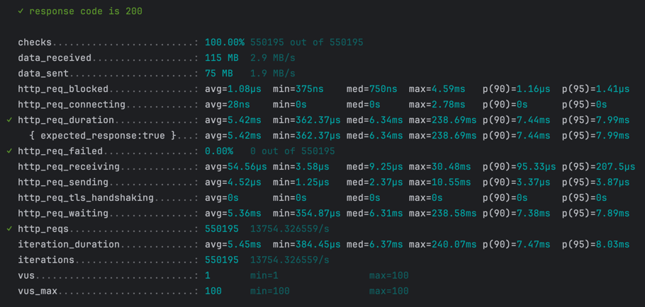
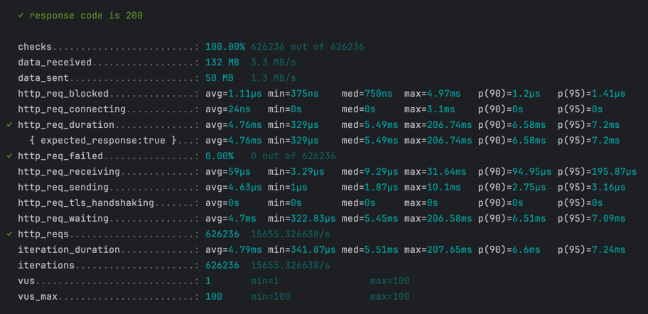

# High-Performance REST API Benchmark Suite

## Table of Contents

1. [Overview](#overview)
2. [Project Structure](#project-structure)
3. [First Steps](#first-steps)
5. [Running Performance Tests](#running-performance-tests)
6. [PHP Project Details](#php-project-details)

---

## Overview

This repository contains **three separate implementations** of a high-performance REST API for tracking website visits  
per country. The goal of the project is to **compare performance and efficiency** across the following languages:

- PHP
- Go
- Rust

> ℹ️ Currently, only the PHP implementation is complete. Go and Rust versions are still in development.

Each implementation exposes the same API interface and is tested under equal conditions using identical performance test  
scenarios.

### PHP Project Details

The PHP implementation is built using:

- PHP 8.4
- Symfony 7.1
- RoadRunner 2024
- Redis 7.4

#### Register Visit Endpoint

Performs write operations, has achieved up to **13,500 RPS** under testing.



---

#### Get Visits Endpoint

Handles read operations, has reached up to **15,600 RPS** during performance tests.



---

## Project Structure

```
visit-counter-benchmarks/  
├── php/         # PHP implementation (Symfony + RoadRunner)  
├── go/          # Go implementation  
├── rust/        # Rust implementation  
├── benchmarks/  # Performance test scripts (k6)  
└── docker/      # Docker-related files  
```

---

## First Steps

### 1. Clone the Repository

```bash
git clone https://github.com/tranxton/visit-counter-benchmarks  
cd visit-counter-benchmarks
```

### 2. Initialize the Project

```bash
make init
```

This command:

1. Sets up the environment and dependencies
2. Triggers tests

---

## Running Performance Tests

### Test Scripts

All performance test scripts are located in:

```
benchmarks/k6/*
```

Please add new test scenarios to this directory.

### Preparing the PHP Implementation for Performance Testing

#### For Production

Use this command to build the PHP application in production mode, optimized for performance testing:

```bash
make php.build.prod
```

#### For Development

Use the following command to build the PHP application in development mode:

```bash
make app.build.dev
```

### Running a Performance Test

```bash
make k6.test.run test=/app/php/register-visit-performance-test.js
```

Replace `/app/php/register-visit-performance-test.js` with the desired script path.

## Accessing the PHP

- URL: http://127.0.0.1:8080

### API Endpoints

#### Update Visit Statistics

POST `/visits/{country}`  
**Description:** Increments the visit counter for the specified country.

Example:

```bash
curl -X POST http://localhost:8080/visits/RU
```

Response:

```json
{
	"RU": 123
}
```

#### Get Visit Statistics

GET `/visits`  
**Description:** Returns a JSON object with total visits per country.

Example:

```bash
curl -X GET http://localhost:8080/visits
```

Response:

```json
{
	"RU": 123,
	"US": 456
}
```
